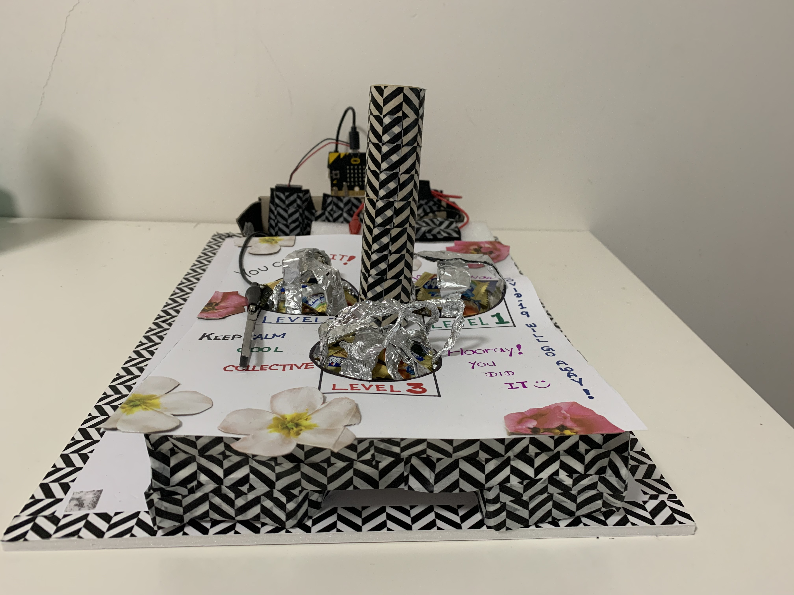
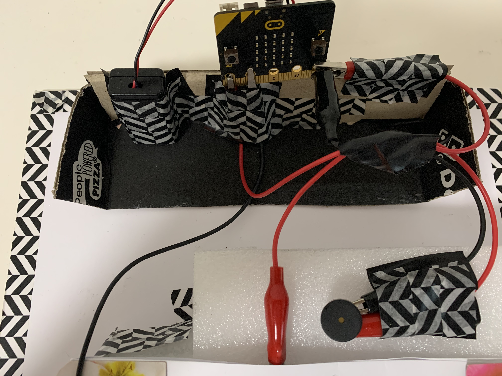
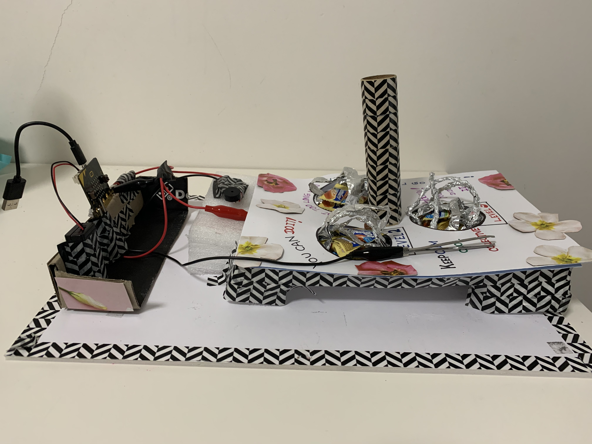

# *Insert project title here*
## Hunters ##
## 1701QCA Making Interaction 2020 Final Project ##

This project is to encourage people to stay at home by allowing them to improve their hand-eye coordination through collecting the most candies in less than 1 minute and 30 seconds. This project is suitable for everyone and there is no age limit. A typical use case would be a common household game, i.e.: Scrabble, Monopoly, and etc.

The following image shows the technical component of the game. Its purpose is to demonstrate how each components interact with each other. 

Video Address: 

### Journal ###
[Process and reflection journal](/journal/journal.md)
