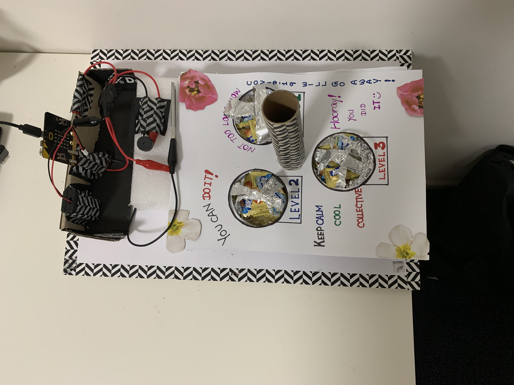
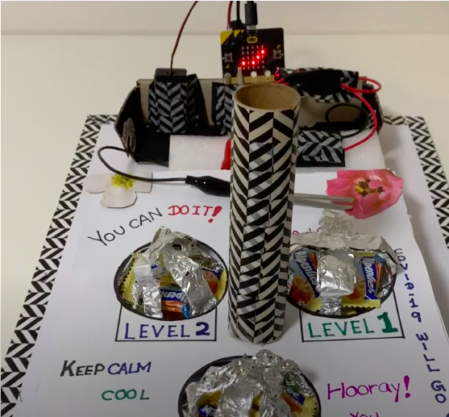

# *Insert project title here*
## Hunters ##
## 1701QCA Making Interaction 2020 Final Project ##

This project is to encourage people to stay at home by allowing them to improve their hand-eye coordination through collecting the most candies in less than 1 minute and 30 seconds. This project is suitable for everyone and there is no age limit. A typical use case would be a common household game, i.e.: Scrabble, Monopoly, and etc.

<!--- SECONDARY IMAGE: Provide some other image that gives a viewer a different perspective on the project such as more about how it functions, the project in use, or something else. This should not just be a different angle of the same object. It should show the project in use if the first image didn't show that, or somehow tell us a different story about the project. --->

Video Address: https://www.youtube.com/watch?v=ELKO_9O4gGY

### Journal ###
[Process and reflection journal](/journal/journal.md)
