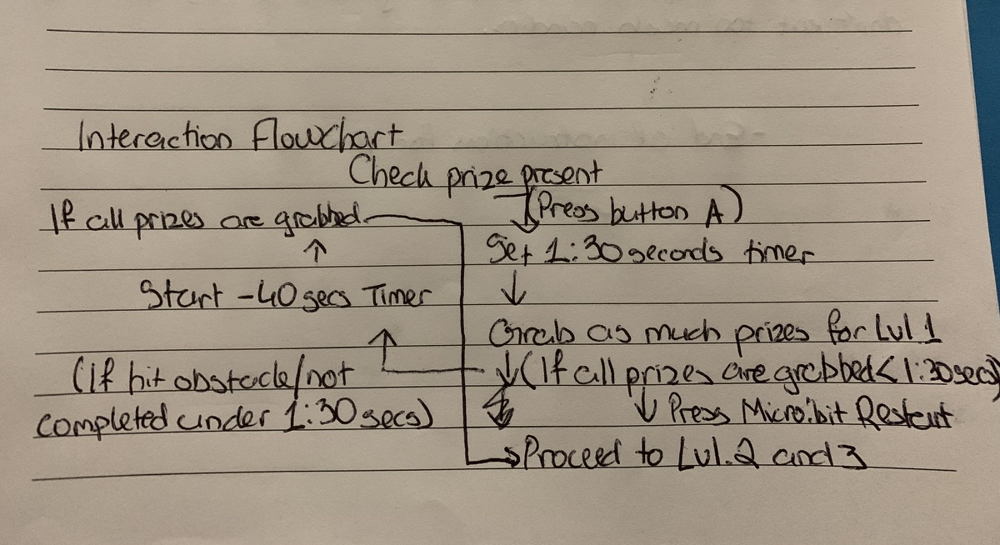

# 1701QCA Final project journal: Hunters

## Related projects ##
### Related project 1 ###
Micro:bit Electro Football 

https://make.techwillsaveus.com/microbit/activities/microfootball

This project is related to my first design concept, because it allows the person to win a game when they've accomplished a series of tasks. 

### Related project 2 ###
Don't touch the wire

https://bryanmmathers.com/dont-touch-wire/

This project made me to realised that I can create different difficulty levels for a project.

### Related project 3 ###
Making a room alarm with your Micro:bit

https://www.youtube.com/watch?time_continue=821&v=igeUhVMqVRw&feature=emb_logo

In terms of the materials and mechnaics of this project, they share basic similarities to my third design concept. 

### Related project 4 ###
Simple Reaction Game

http://web1.muirfield-h.schools.nsw.edu.au/mahara/view/view.php?id=15903

The circuitry of this project is relatively similar to my third design concept, in the way that if the aluminium foil is tapped, the Micro:bit will be triggered and an action will follow. 

### Rekated project 5 ###
DIY #micro:bit Toss Game

https://www.youtube.com/watch?v=aa11moVsfOg

The main elements of this project: aluminum foil, and basic circuitry logic matches my third design concept.

### Related project 6 ###
BBC mirco:bit Electro Fingers

https://make.techwillsaveus.com/microbit/activities/electro-fingers

Same concept but different method and rules as my third design concept. The concept only allows the player to pick up the prize that is surrounded by obstacles using only a picker, whereas, the related project allows the player to use a knitted glove to pick up the maximum amount of prizes per turn.

## Other research ##
https://study.com/academy/lesson/what-is-hand-eye-coordination-definition-skills-development.html 
The chosen project focuses largely on the concept of hand-eye coordination. Hand-eye coordiation is vastly important in daily life, where simple tasks can be seen as impossible without/with low hand-eye coordination. The coordiation, therefore, can be defined as "the use of eyes to direct muscles towards a task", where it can be used to control small and large movements (study.com).

https://ilslearningcorner.com/2016-02-hand-eye-coordination-how-hand-eye-coordination-helps-early-readers/ 
To help me to understand why hand-eye coordination is important, Integrated Learning Strategies simply views the concept as important elements in a person's "proprioception, vestibular, visual processing and sensory-motor. If the person struggles with hand-eye coordination, you may find they have a hard time with balance and coordination, focusing their eyes on their hand movements, poor handwriting, playing sports, and trouble griping their pencil." This means that hand-eye coordination is a life skills that most people must have in great amount, however, one should be entitled to improve on the important life skils while living in the quick paced lifestyle in today's world.

https://make.techwillsaveus.com/microbit/activities/electro-fingers 
The following project provided an insight of how I envisioned my third design concept. The methods and concept are similar, in which I can turn my third concept into reality by understanding the operations and order in this project. In addition, this project is a prime example of a Micro:bit project in action with relations to the hand-eye coordination concept.

In terms of the overall project, I was inspired by the disastrous impacts of the Covid-19 Pandemic and the heroic individuals that are working effortlessly everyday to stop the pandemic. One project that comes to mind is the Australian Government's Coronavirus Australia mobile phone app. The app encourages Australians to stay positive and healthy admist the pandemic through different ways: providing health advice, get instant access to the current situation in Australia, check symptoms, find relevant infromation, and etc. The app is available on both the App Store and the Google Play Store, and is suitable for IOS and Android. The app is unrelated to my project, but it made me to realise that I can create a simple game that encourages people to stay indoors, to collectively challenge and play the game with people in their household, and to potentially have something to keep their mind busy through improving their hand-eye coordination.

## Conceptual development ##

### Design intent ###
To contribute efforts in potentially encourage people to stay indoors. Not only this, people attention span will be able to increase and their determination will too as they'll be determined to beat their personal bests. The project will be call Hunters

### Design ideation ###
Originally I wanted to develop a sport field/facility that will allow different types of sports to be played within a confined space. The field can be made by a shoebox or an object with similar dimensions.

The first idea was to have a sport field that can hold 2 sports: international football and basketball, but they can't be played concurrently - as only one net at one end to score. The second idea was to have the same 2 sports but with a divider net/wall in between, have multiple Micro:bit to keep score, and can play concurrently.

The third idea was to have more than 2 sports, but on a bigger scale, similar to the size of a coffee table or something to the extent.

I switched my original idea to contribute efforts in the current Covid-19 Pandemic, by potentially encouraging people to stay indoors. This will be done through increasing people's attention span and determination, as people will attempt to not touch aluminum coil whilst crossing it throughout different levels and challenges. The project will be call Don't Touch The Wire.

The second design concept gave me the overall concept for my project: hand-eye coordination. Using the materials and concept from my second concept, I am able to create a family-friendly game where people will try to grab a prize without touching the surrounding to avoid loosing and triggering the alarm on.

### Final design concept ###
The second design concept gave me the overall concept for my project: hand-eye coordination. Using the materials and concept from my second concept, I am able to create a family-friendly game where people will try to grab a prize without touching the surrounding to avoid loosing and triggering the alarm on.

### Interaction flowchart ###

## Process documentation ##
After my prototype submission, I've received a lot of feedbacks that are extremely useful to develop my prototype into a final piece. A large portion of the feedbacks focus on the aesthetic side of my project, while others are on the technical side.
The feedbacks all started with the conceptual prototype forum that I started on L@G, my groupmate was very helpful in suggesting setting a difficulty level for my project. During this stage, I did not think about how my project could benefit from setting different challenges, and what will my users benefit from the game. However, this was quickly all changed when I realised that I could create obstacles using the same material as my project's base, in which the following image will demonstrate this change.

Following my change, I've constructed two lists for Week 10 and 11 of the course, during which I've completed the tasks and goals within the two weeks. The following lists detail all tasks that was set for Week 10 and 11:
Week 10: 
- Set 1:30 seconds for each prize pocket via phone timer.
- If player touch obstacle or foil, they will only have 40 seconds per pocket left. 
- Change from wire jumper that connects to the tin foil base to a crocodile clip to detect the foil better. 
- Add cardboard as base for stronger game. 
- If player touch obstacle, a warning alert will sound, and Micro:bit will start the 40 seconds timer. 
- If player fails to pick up all prizes in 1:30 seconds, put all prizes back in the playing pocket, and restart the game. 
- If player picked all prizes in a pocket in 1:30 seconds, player gets to keep all the prizes.

Week 11:
- Put another A4 piece over the current and design it.
- Conceal most wires using black electricity-grade tape. 
- Design all 4 support pillars.
- Design the outer layer of the pizza box.
- Make obstacles stronger/harder for the player to get the prizes. 

During week 10, I received a feedback from my tutor, suggesting that I could integrate the timer into the Microbit instead of needing to use a phone. Which allows the game to be a standalone experience instead of requiring an external device. This suggestion influenced greatly to my final code for the project, and it was the feedback that allowed the simultaneous timers - where if a player hits the obstacle, a 40 seconds timer will be initiated.
After my tutor's suggestion, I decided that I wanted to obtain more constructive feedbacks in order to benefit my project. I started off-school discussions with my tutor via Email, where the Emails focuses largely on the written component of the game's rules. In other words, I was advised to physically write the instructions that will make sure the game's player to understand the game in a simplified method. Since then, I've made an instruction manual for the player, detailing how to start the game, a limit on one player at a time, what is being displayed on the screen, how to reset the game, how to change the game's difficulty, and what each tone represents, in which the following image demonstrates the instruction manual.

In addition to the Email, I was challenged to increase the difficulty of the game's obstacles. I achieved this challenge with the addition of the cylindrical tube attached in the middle of the game, where it will make the maneuvering of the clippers more difficult, thereby making it harder for the game's player to get the candies.

## Final code ##

To justify as to why the timing doesn't add up in the code, I've accounted for the duration of certain elements that happens before the timing begins or continues. For example, the duration of show string "10 SECS" lasts for exactly 5 seconds, in which it will laregly influence the overall countdown. 

## Design process discussion ##

I am going to utilise the Double Diamond design methodology, as they perfectly capture the design process that I went through during this assessment. I wanted to create a project that can either contribute to the local community by maximsing public spaces or to devote my efforts into the Covid-19 pandemic. These two directions helped me to begin with the discover and define stages, where I discovered the topics that I am interested in and defined the different projects that I could explore.

After creating a prototype for a rendition of my second design concept, I realised that I want to contribute some efforts to alleviate the situation of the padenmic and create a game that will keep the same concept as my second design concept. Arguably, my third concept came from the developmental phase of the Double Diamond methodolgy, where I creatively design a project based off the hand-eye coordination focal concept. I realised that my second concept design can easily be replicated and has been achieved by numerous Mirco:bit projects, and in order to deliver a successful outcome for this assessment, I would have to design an interesting design that shows an in-depth level of technical development and physical fabrication.

Revolving around the task's underlying requirements and my own criteria, I created a prototype for my final concept, using the same materials and knowledge as my second design concept. The developments of the prototype can also be reflected in relations to the conducted research on non-related and related materials/projects, where I was laregly inspired by the works of those who are contributing efforts in combating against the global crisis, in which it motivated me to create a game that allows a player to improve the important hand-eye coordination lifeskill whilst encouraging them to stay indoors to prevent the pandemic from spreading.

After receving feedbacks and having discussions from my teammate and tutors, I've successfully transitioned my prototype to my final piece. During the transition, I've focused largely on the rules, the difficulty, and the aesthetic of the game. In my opionion, the transitioning belong to the final stages in the Double Diamond design methodology, where I've finished developing my idea, delivered my game, and is prepring for a potential evolving my prduct. 

## Reflection ##
With regards to the identified sources, the project have been vastly benefited. From how the materials interact with one another, to setting game's objectives and different challenging levels, and to the circuitry and technical components of the game, the technical aspects and overall "feel and look" of the game was able to develop and made. 

In terms of novelty, the game focuses on two inspirations from life, the concept of hand-eye coordination and the negative impacts of Covid-19. 
The hand-eye coordination concept is an important life skills that most people must have in great amount. Without the life skill, simple tasks can be seen as impossible due to without/with low hand-eye coordination.
In terms of the overall project, I was inspired by the negative impacts of the Covid-19 Pandemic. In my opinion, the Australian Government's Coronavirus Australia mobile app is the app that largely inspired this project. The app encourages Australians to stay positive and healthy admist the pandemic through different ways: providing health advice, get instant access to the current situation in Australia, check symptoms, find relevant infromation, and etc. The app is available on both the App Store and the Google Play Store, and is suitable for IOS and Android. The app is unrelated to my project, but it made me to realise that I can create a simple game that encourages people to stay indoors, and to collectively challenge and play the game with people in their household.
These two inspirations have collectively allowed me to create a simple, yet meaningful game that can keep people to stay indoors during this time period, and to improve their hand-eye coordination.

Possible extensions to Hunters could be to create a similar game that further challenges the players, through creating a deeper prize pocket, or create different styles of keeping track of the time, or even enabling a score system where different people get ranked based on how fast they've completed the game or techniques that were used to obtain the prizes. All of these extensions can be explored through different usage of the Micro:bit's sensors, parts, or even coded in a different language like MicroPython, C#, or even JavaScript. 
